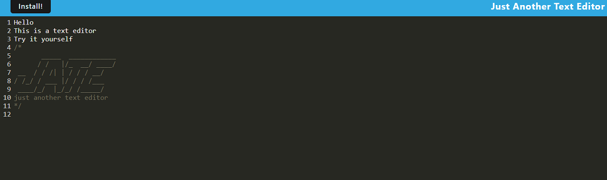

# JATE- Just Another Text Editor

JATE is a simple text editor that utilizes PWA technology to allow for offline editing!

## Installation

You can install JATE right from the webpage! Simply click the "Install" button that appears in the top left corner of the screen when you visit the site.

## Mockup

## Usage

To try JATE, simply [click here](https://jate-offline-text-editor.herokuapp.com/) and start editing! JATE will save your notes so you can return to them later.
